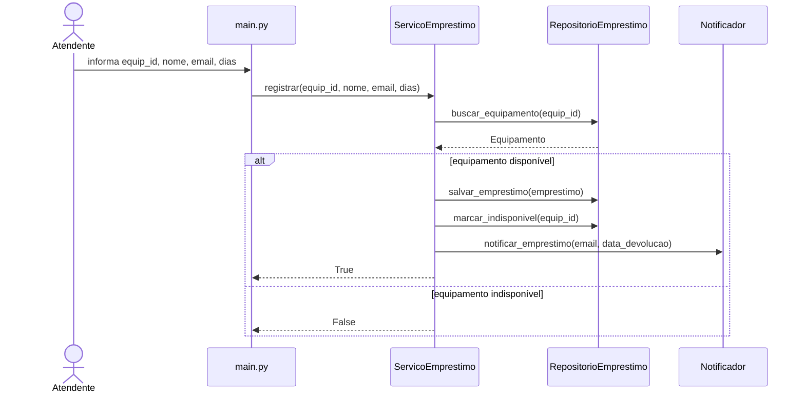
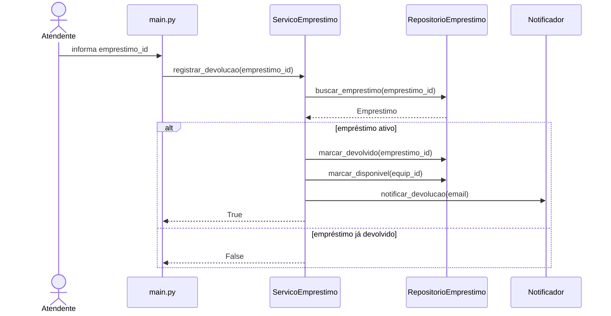
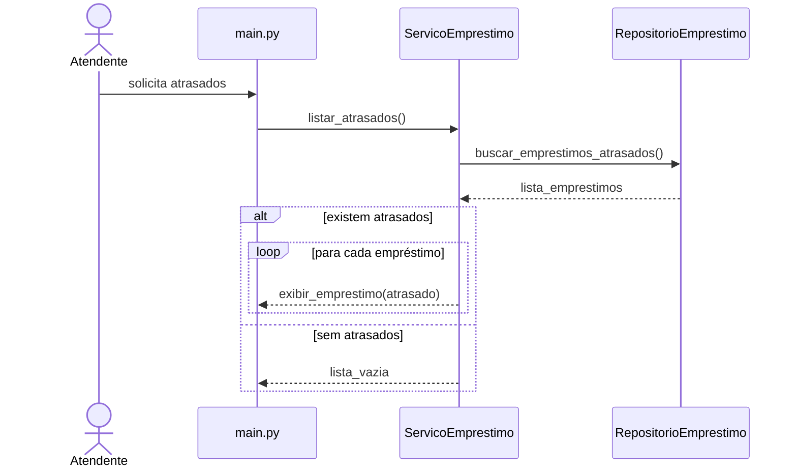

# Atividade 4A — Materializar Projeto

## Decomposição em camadas

### modelos/equipamento.py
Responsável por representar os dados de equipamentos, garantindo contrato tipado.

### modelos/emprestimo.py
Representa formalmente os empréstimos.

### servicos/servico_emprestimo.py
Centraliza regras de negócio.

### servicos/notificador.py
Responsável por notificações.

### repositorios/repositorio_emprestimo.py
Gerencia persistência e consultas.

### main.py
Camada de entrada.

---

## Diagramas de sequência

### UC01 — Registrar Empréstimo

### UC02 — Registrar Devolução

### UC03 — Listar Empréstimos em Atraso

